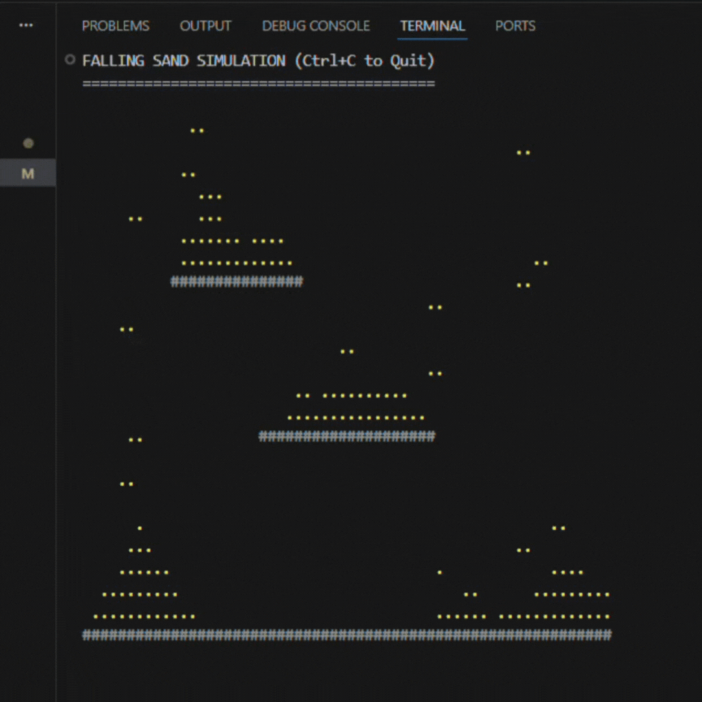

# ⏳ Terminal Falling Sand Simulation


A high-performance **Cellular Automata** simulation running directly in your terminal. It simulates granular physics (gravity, stacking, and displacement) using efficient memory manipulation and ASCII rendering.



## ✨ Key Features

* **⚡ Zero Dependencies:** Written in pure C without external physics engines.
* **🚀 High Performance:** Uses **Double Buffering** techniques to render frames smoothly without flickering.
* **🧠 Smart Physics:** Implements gravity and dispersion logic (sand piles up and slides down slopes naturally).
* **🎨 Cross-Platform:** Works on Windows (MinGW), Linux, and macOS.

## 🛠️ How it Works (Technical Depth)

This isn't just a loop; it's a simulation of **particle physics** optimized for terminal I/O.

### 1. Bottom-Up Iteration
Unlike standard loops, the physics engine iterates from the **bottom of the grid to the top**.
> *Why?* Iterating top-down causes particles to "teleport" to the bottom in a single frame. Reverse iteration ensures each particle moves exactly one step per frame, creating realistic momentum.

### 2. Double Buffering
Standard `printf` inside loops causes screen tearing and flickering. This program constructs the entire frame in a hidden `char` buffer and flushes it to stdout in a **single syscall**, ensuring 60 FPS smooth rendering.

## 🚀 Installation & Usage

### Option 1: Using Make (Recommended)
If you have `make` installed:
```bash
make build
make run
```

### Option 2: Manual Compilation
```bash
mkdir bin
gcc -O2 src/main.c -o bin/sand_sim
./bin/sand_sim
```

## 🚀 Installation & Usage
* The simulation runs automatically.
* Press ```Ctrl + C ``` to exit.